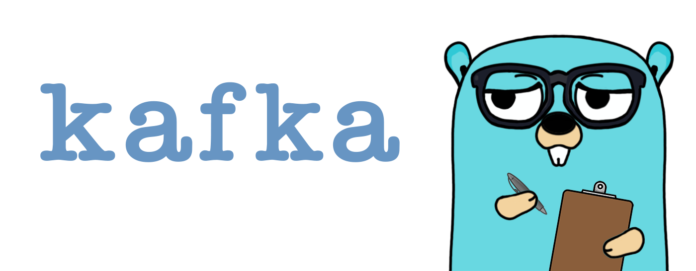

<div align="center" style="margin-bottom:20px">
  
  <h1><i>making Kafka less Kafka-esque</i></h1>
  <div align="center">
    <a href="https://github.com/blugnu/kafka/actions/workflows/release.yml">
        
    </a>
    <a href="https://goreportcard.com/report/github.com/blugnu/kafka" >
        
    </a>
    <a>
        = 1.14" src="https://img.shields.io/github/go-mod/go-version/blugnu/kafka?style=flat-square"/>
    </a>
    <a href="https://github.com/blugnu/kafka/blob/master/LICENSE">
        
    </a>
    <a href="https://coveralls.io/github/blugnu/kafka?branch=master">
        
    </a>
    <a href="https://pkg.go.dev/github.com/blugnu/kafka">
        
    </a>
    <a href="https://coderabbit.ai">
        
    </a>
  </div>
</div>

<br>

# blugnu/kafka

## Features

- [x] **Discoverable Configuration**: Provides option functions for configuring Kafka clients,
  with separation of general, consumer and producer-specific configuration

- [x] **Reduced Boilerplate**: Provides a complete implementation of a Kafka consumer with
  a single function call, handling all the boilerplate code for you including offset
  commits, signal handling and graceful shutdown

- [x] **Producer Retries**: Provides a producer implementation that will retry sending
  messages to Kafka in the event of a timeout (configurable timeout and `MaxRetries`)

- [x] **Mock Producer**: Provides a mock producer implementation that can be used
  for testing that applications produce expected messages

## Installation

```bash
go get github.com/blugnu/kafka
```

## Usage

- Establish a base configuration (e.g. bootstrap servers)
- Configure a consumer and/or producer
- Start the consumer

## Example

```go
package main

import (
  "context"
  "fmt"
  "os"
  "os/signal"
  "syscall"

  "github.com/blugnu/kafka"
)

func HandleEvent(ctx context.Context, msg *kafka.Message) error {
  fmt.Printf("received message: %s\n", string(msg.Value))
  return nil
}

func main() {
  // initialise a base configuration
  cfg := kafka.NewConfig(
    kafka.BootstrapServers("localhost:9092"),
  )

  // configure a consumer
  consumer, err := kafka.NewConsumer(cfg,
    kafka.ConsumerGroupID("my-group"),
    kafka.TopicHandler("event", kafka.HandlerFunc(HandleEvent)),
  )
  if err != nil {
    log.Fatal("error creating consumer:", err)
  }

  // start the consumer
  if err := consumer.Start(ctx); err != nil {
    log.Fatal(err)
  }

  if err := consumer.Wait(); err != nil {
    log.Fatal(err)
  }
}
```

# Logging

To avoid importing a specific logging library or imposing a log format on applications,
logs are written using internal log hooks.  These are set to no-op by default.

To enable logging you must call the `kafka.EnableLogs` function, providing functions
to log entries at different levels as required.  The levels supported are those at which
Kafka logs messages: `DEBUG`, `INFO` and `ERROR`.

The logging function at each level is passed a `context.Context`, the log message, and
a `kafka.LogInfo` struct containing additional information about the log entry.

For example, the following might be used to initialise a `blugnu/ulog` context logger
and enable logging of `ERROR` level Kafka logs to that logger; logs at all other levels
are left as no-ops:

```go
func logger(ctx context.Context) (context.Context, ulog.Logger, func()) {
    kafka.EnableLogs(&kafka.Loggers{
        Error: func(ctx context.Context, msg string, info: kafka.LogInfo) {
            log := ulog.FromContext(ctx)
            if info.Consumer != nil {
                log = log.WithField("consumer", *info.Consumer)
            }
            if info.Topic != nil {
                log = log.WithField("topic", *info.Topic)
            }
            log.Error(msg)
        },
    })

    log, cfn, err := ulog.NewLogger(
        ulog.WithLevel(ulog.DebugLevel),
    )
    if err != {
        log.Fatal(fmt.Errorf("error initialising logger: %v", err))
    }

    return ulog.ContextWithLogger(ctx, log), log, cfn
}
```

## Default Logging

A `nil` argument may be passed to `EnableLogs` to enable default logging, which will
write simple text logs using the standard `log` package.

Default logging is also emitted if a zero-value `&Loggers{}` is passed to `EnableLogs`, i.e.
all functions set `nil`.

> **Note**: Default logging is not recommended for production use.
